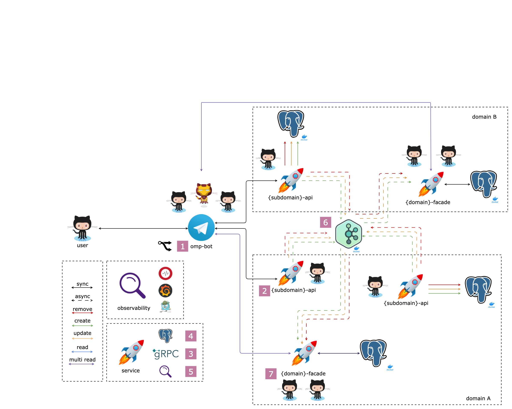

# Ozon Marketplace Project



### Задание 1

1. Сделать форк **ozonmp/omp-bot** репозитория в свой профиль
2. Запросить у своего тьютора свой домен/поддомен: **{domain}/{subdomain}**
3. Добавить поддержку следующих команд:

Дальше везде используются **placeholder**-ы:
- `{domain}`,`{Domain}`
- `{subdomain}`,`{Subdomain}`

На пример для поддомена `package` из домена `logistic` значение **placeholder**-ов будет:
- `{domain}`,`{Domain}` = `logistic`,`Logistic`
- `{subdomain}`,`{Subdomain}` = `package`,`Package`
- `{domain}`/`{subdomain}` = `logistic`/`package`

```
/help-{domain}-{subdomain} — print list of commands
/get-{domain}-{subdomain} — get a entity
/list-{domain}-{subdomain} — get a list of your entity (💎: with pagination via telegram keyboard)
/delete-{domain}-{subdomain} — delete an existing entity

/new-{domain}-{subdomain} — create a new entity // not implemented (💎: implement list fields via arguments)
/edit-{domain}-{subdomain} — edit a entity      // not implemented
```

Для добавления поддержки команд в рамках своего поддомена:

1. Написать структуру `{Subdomain}` с методом `String()`
2. Написать интерфейс `{Subdomain}Service` и **dummy** имплементацию
3. Написать интерфейс `{Subdomain}Commander` по обработке команд

---

2. Написать интерфейс `{Subdomain}Service` в **internal/service/{domain}/{subdomain}.go**

```go
package {domain}

import "github.com/ozonmp/omp-bot/internal/model/{domain}"

type {Subdomain}Service interface {
  Describe({subdomain}_id uint64) (*{domain}.{Subdomain}, error)
  List(cursor uint64, limit uint64) ([])
  Create({domain}.{Subdomain}) (uint64, error)
  Update({subdomain}_id uint64, {subdomain} {domain}.{Subdomain}) error
  Remove({subdomain}_id uint64) (bool, error)
}

type Dummy{Subdomain}Service struct {}

func NewDummy{Subdomain}Service() Dummy{Subdomain}Service {
  return &Dummy{Subdomain}Service{}
}

// ...
```

---

3. Написать интерфейс `{Subdomain}Commander` по обработке команд в **internal/command/{domain}/{subdomain}.go**

```go
package {domain}

import (
  model "github.com/ozonmp/omp-bot/internal/model/{domain}"
  service "github.com/ozonmp/omp-bot/internal/service/{domain}"
)

type {Subdomain}Commander interface {
  Help(inputMsg *tgbotapi.Message)
  Get(inputMsg *tgbotapi.Message)
  List(inputMsg *tgbotapi.Message)
  Delete(inputMsg *tgbotapi.Message)

  New(inputMsg *tgbotapi.Message)    // return error not implemented
  Edit(inputMsg *tgbotapi.Message)   // return error not implemented
}

func New{Subdomain}Commander(bot *tgbotapi.BotAPI, service service.{Subdomain}Service) {Subdomain}Commander {
  // ...
}
```
